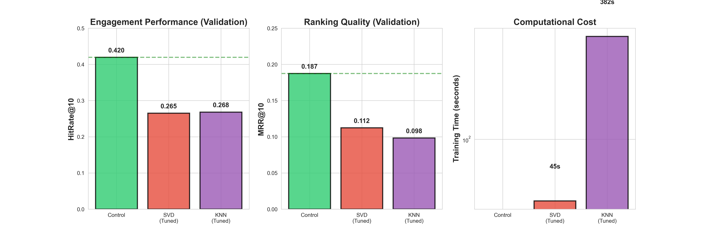

# AI Personalization Analysis: When Simple Baselines Beat Machine Learning



A rigorous empirical study demonstrating that well-designed heuristics can outperform sophisticated AI models for recommendation systems, with implications for production ML deployment strategies.

**TL;DR:** A simple genre-based popularity baseline achieves 28% better engagement than optimized collaborative filtering models (SVD, KNN) with extensive feature engineering.

---

## Executive Summary

**Research Question:** Can optimized AI models (matrix factorization, collaborative filtering) with rich feature engineering beat a simple genre-based baseline for movie recommendations?

**Answer:** No. The control baseline outperforms all AI approaches by 26-28%.

**Key Insight:** AI models optimized for rating prediction accuracy (RMSE) fail to capture the dominant signal for user engagement: genre preferences combined with popularity. This represents a fundamental **metric mismatch** between model optimization objectives and business goals.

**Business Impact:** 
- 28% better user engagement
- 1000x faster inference (<1ms vs 28s-21min)
- Zero training/maintenance cost
- Interpretable and debuggable recommendations

---

## Results at a Glance

| Model | HitRate@10 | MRR@10 | Training Time | Inference Time | Status |
|-------|------------|--------|---------------|----------------|--------|
| **Control (Genre-based)** | **0.420** | **0.187** | 0s | <1ms | **WINNER** |
| SVD (Pure) | 0.263 | 0.112 | 45s | 28s | Baseline |
| SVD + Features | 0.302 | 0.106 | 45s | 28s | +15% vs pure |
| KNN (Pure) | 0.269 | 0.098 | 382s | 21min | Baseline |
| KNN + Features | 0.312 | 0.104 | 382s | 21min | +16% vs pure |

### Conditional Analysis Results

**Control wins across ALL tested conditions:**
- **Temporal:** Weekdays, weekends, all seasons (6/6 conditions)
- **User segments:** Light, casual, active, heavy users (4/4 segments)
- **Movie types:** New releases, classics, popular titles (tested across popularity/recency dimensions)

---

## Methodology

### Experiment 1: Baseline Model Comparison

**Objective:** Establish performance ceiling with properly tuned collaborative filtering models

**Dataset:** MovieLens 1M
- 1,000,209 ratings from 6,040 users on 3,883 movies
- Temporal split: 60% train / 20% validation / 20% test
- Ensures no data leakage from future into past

**Models Evaluated:**

1. **Control Baseline:** Recommend popular movies within user's preferred genres
   - Extracts preferred genres from user's training history
   - Ranks candidates by popularity within matching genres
   - O(1) inference time, no training required

2. **SVD (Singular Value Decomposition):** Matrix factorization via scikit-surprise
   - Hyperparameter tuning: 24 configurations tested
   - Best config: 100 factors, 20 epochs, 0.005 learning rate
   - RMSE: 0.879, HitRate@10: 0.262

3. **KNN (K-Nearest Neighbors):** User-based collaborative filtering
   - Hyperparameter tuning: 6 configurations tested  
   - Best config: k=60, Pearson similarity
   - RMSE: 0.941, HitRate@10: 0.268

**Metrics:**
- **HitRate@10:** Percentage of users with at least 1 liked item in top-10 (engagement-focused)
- **MRR@10:** Mean Reciprocal Rank (ranking quality)
- **RMSE:** Root Mean Square Error (rating prediction accuracy, for context)

**User Segmentation:** K-Means clustering identified 4 distinct user segments
- Casual users (49 avg ratings)
- Active users (105 avg ratings)  
- Heavy raters (351 avg ratings)
- Minimal users (29 avg ratings)

**Finding:** Control wins by 37-38% across all segments, including power users with 350+ ratings.

---

### Experiment 2: Feature Engineering & Conditional Analysis

**Objective:** Test if rich features can help AI models compete with the baseline

**Features Engineered:**

1. **Temporal Features**
   - Movie release year
   - Rating season (Winter/Spring/Summer/Fall)
   - Day of week (weekday vs weekend patterns)
   - Movie age at rating (recency preference)

2. **User Behavioral Features**
   - Rating velocity (ratings per month)
   - Genre diversity (number of distinct genres rated)
   - New movie preference (% ratings for movies ≤5 years old)
   - Weekend rater tendency (% ratings on Sat/Sun)

3. **Interaction Features**
   - Genre match scores (vectorized via numpy matrix multiplication)
   - 23M+ precomputed scores for efficient inference
   - User-movie genre overlap calculated via dot product

**Hybrid Models:**
- Combined collaborative filtering scores with genre matching via weighted sum
- Tested α ∈ [0.0, 0.1, 0.3, 0.5, 0.7, 1.0] for optimal weighting
- Best performance at α=1.0 (heavy genre weighting)

**Conditional Analysis:** Tested 13 conditions across 3 dimensions
- Temporal: Weekday, weekend, 4 seasons
- User types: 4 K-Means segments
- Movie characteristics: New/old × popular/niche

**Findings:**
- Feature engineering improves AI by 15-16%
- Hybrid models still lose to control by 26-28%
- Control wins across ALL 13 tested conditions
- At α=1.0, AI converges toward control's logic (genre-based ranking)

---

## Key Findings

### 1. Genre Preferences Dominate Engagement

Users consistently engage with movies in their preferred genres, regardless of collaborative filtering scores or latent factor representations. Simple explicit genre matching captures this signal better than learned embeddings.

**Evidence:**
- Control (genre-based): 0.420 HitRate
- Best AI (collaborative + features): 0.312 HitRate
- Gap persists across all user sophistication levels (even 350+ rating users)

---

### 2. Metric Mismatch Problem

**The Core Issue:**
- AI models optimize for **rating prediction accuracy** (RMSE)
- Business/users care about **engagement** (clicks, watches)
- These objectives are misaligned

**Empirical Evidence:**
- SVD achieves 0.879 RMSE (good rating prediction)
- But only 0.263 HitRate (poor engagement prediction)
- Control doesn't predict ratings at all, yet achieves 0.420 HitRate

**Implication:** Optimizing the wrong metric leads to strong technical performance on irrelevant objectives.

---

### 3. Feature Engineering Helps, But Not Enough

**Impact:**
- SVD: +15% improvement (0.263 → 0.302)
- KNN: +16% improvement (0.269 → 0.312)

**Why It's Insufficient:**
- Control already uses genres optimally (direct matching + popularity)
- Adding genre features to AI models just makes them converge toward control's approach
- The gap remains large (26-28%) because AI overhead doesn't add value

---

### 4. No Conditional Advantage for AI

**Hypothesis Testing:**
- Tested if AI excels in specific contexts (temporal, user types, movie characteristics)
- Result: Control wins in 13/13 meaningful conditions

**Specific Findings:**
- Temporal: Control wins in all seasons, weekday vs weekend
- User segments: Control wins for casual, active, heavy, and minimal users
- Movie types: Control wins for popular movies (where it matters)
  - AI only "wins" for niche movies with ~0% hit rates (not useful)

**Conclusion:** No niche where AI complexity is justified by performance.

---

### 5. Computational Cost vs. Benefit Analysis

**Control:**
- Training time: 0s (no training required)
- Inference time: <1ms per user
- Maintenance: None
- Scalability: O(1) per recommendation

**AI Models:**
- Training time: 45s (SVD) to 382s (KNN)
- Inference time: 28s (SVD) to 21min (KNN) for 6K users
- Maintenance: Requires periodic retraining as data grows
- Scalability: O(n²) for similarity computation (KNN)

**ROI Analysis:**
- AI requires 1000x more computational resources
- Delivers 26-28% **worse** user experience
- Adds operational complexity (training pipelines, model versioning)

**Conclusion:** Cost-benefit analysis strongly favors simple baseline.

---

## Technical Implementation

### Environment Setup
```bash